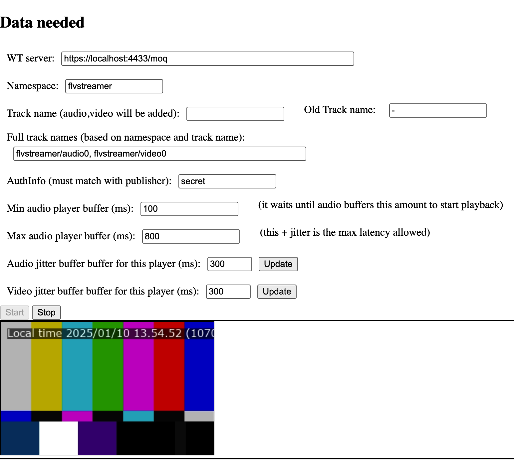
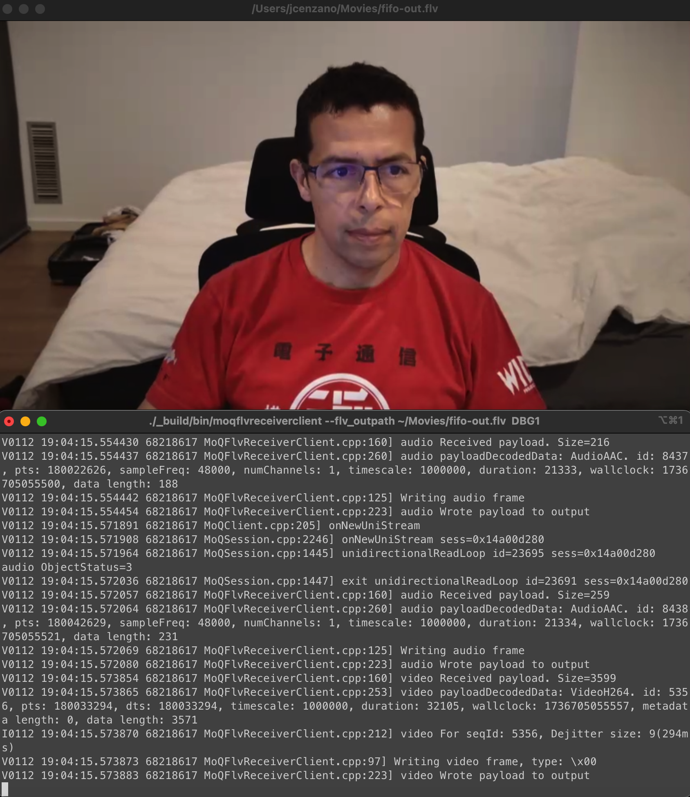

# moxygen test using `MoQFlvStreamerClient` and `MoQFlvReceiverClient`.

## Introduction
To simplify testing MOQ at media level we added the following binaries to the repo `MoQFlvStreamerClient` and `MoQFlvReceiverClient`.


Fig1: MoQFlvStreamerClient, MoQFlvReceiverClient, and moxygen

Remeber that ffmpeg allows you to install capture cards and playback cards (such DDD), this allows to send any broadcast feed (SDI) via MOQ or/and send any MOQ feed on to a broadcaster via SDI.


Fig2: Ingest SDI and send it via MOQ

### `MoQFlvStreamerClient`
Convert any FLV (h264 / AAC-LC) file or stream (fifo) into MOQ, publishing it to a relay using MoqMi packager (see RFC [draft-cenzano-moq-media-interop](https://datatracker.ietf.org/doc/draft-cenzano-moq-media-interop/))

     - Arguments
```
-audio_track_name (Audio track Name) type: string default: "audio0"
-connect_timeout (Connect timeout (ms)) type: int32 default: 1000
-connect_url (URL for webtransport server) type: string
    default: "https://localhost:4433/moq"
-input_flv_file (FLV input fifo file) type: string default: ""
-quic_transport (Use raw QUIC transport) type: bool default: false
-track_namespace (Track Namespace) type: string default: "flvstreamer"
-track_namespace_delimiter (Track Namespace Delimiter) type: string
    default: "/"
-transaction_timeout (Transaction timeout (s)) type: int32 default: 120
-video_track_name (Video track Name) type: string default: "video0"
```

### `MoQFlvReceiverClient`
Subscribes to a relay for a video and audio track, demuxes them from MoqMi (expecting h264 / AAC-LC), transmuxes them to FLV and saves that to disc (or stream using fifo)

- Arguments
```
-audio_track_name (Track Name) type: string default: "audio0"
-connect_timeout (Connect timeout (ms)) type: int32 default: 1000
-connect_url (URL for webtransport server) type: string
    default: "https://localhost:4433/moq"
-fetch (Use fetch rather than subscribe) type: bool default: false
-flv_outpath (File name to save the received FLV file to (ex:
    /tmp/test.flv)) type: string default: ""
-quic_transport (Use raw QUIC transport) type: bool default: false
-track_namespace (Track Namespace) type: string default: "flvstreamer"
-track_namespace_delimiter (Track Namespace Delimiter) type: string
    default: "/"
-transaction_timeout (Transaction timeout (s)) type: int32 default: 120
-video_track_name (Video track Name) type: string default: "video0"
```

## Stream VOD file simulating live stream

Important you follow the next steps in order (when fifo pipes are involved is important to send data before we connect the reader)

- Start relay (terminal1)
```
./_build/bin/moqrelayserver -port 4433 -cert ./certs/certificate.pem -key ./certs/certificate.key -endpoint "/moq" --logging DBG1
```

Note: Look at [README.md](./README.md) on how to gernerate certificates

- Stream FLV live stream in real time to a fifo (Speed = x1) (terminal2)
```
mkfifo ~/Movies/fifo.flv

ffmpeg -y -f lavfi -re -i smptebars=duration=300:size=320x200:rate=30 -f lavfi -re -i sine=frequency=1000:duration=300:sample_rate=48000 -pix_fmt yuv420p -c:v libx264 -b:v 180k -g 60 -keyint_min 60 -profile:v baseline -preset veryfast -c:a aac -b:a 96k -vf "drawtext=fontfile=/usr/share/fonts/dejavu-sans-fonts/DejaVuSans.ttf: text=\'Local time %{localtime\: %Y\/%m\/%d %H.%M.%S} (%{n})\': x=10: y=10: fontsize=16: fontcolor=white: box=1: boxcolor=0x00000099" -f flv ~/Movies/fifo.flv
```

Note: fontfile location can change depending on OS

- Connect streamer to that fifo (terminal3)
```
./_build/bin/moqflvstreamerclient -input_flv_file ~/Movies/fifo.flv --logging DBG1
```
This will read and demux FLV data (expecting 1 video in h264 and 1 audio in AAC-LC) and will announce the namespace `flvstreamer` (dafeult value) to the relay

## Save stream to a file

Assuming we already did all specified in [Stream VOD file simulating live stream](#stream-vod-file-simulating-live-stream)


- Start receiver (terminal4)
```
./_build/bin/moqflvreceiverclient --flv_outpath ~/Movies/my-moq-out.flv --logging DBG1
```
This will subscribe to video `video0` and audio `audio0` tracks from `flvstreamer` namespace (default values), demux the data from MOQMi, and mux it into valid FLV data. It is expecting 1 video in h264 and 1 audio in AAC-LC.

- Check / play the file

You can check the correctness of the genated file with `ffprobe`
```
ffprobe ~/Movies/my-moq-out.flv
...
Input #0, flv, from '/Users/jcenzano/Movies/my-moq-out.flv':
  Duration: 00:01:08.82, start: 55.573000, bitrate: 37 kb/s
  Stream #0:0: Audio: aac (LC), 48000 Hz, mono, fltp
  Stream #0:1: Video: h264 (Constrained Baseline), yuv420p(tv, bt470bg/unknown/unknown, progressive), 320x200 [SAR 1:1 DAR 8:5], 30.30 fps, 30 tbr, 1k tbn
```

Or if you system has UI, you can play it back with any media player, for instance:
```
ffplay ~/Movies/my-moq-out.flv
```

## Watch it live (OS needs UI)

Assuming we already did all specified in [Stream VOD file simulating live stream](#stream-vod-file-simulating-live-stream)

- Create out fifo (terminal4)
```
mkfifo ~/Movies/fifo-out.flv
```

- Start the player (terminal4)
```
ffplay ~/Movies/fifo-out.flv
```

- Start receiver (terminal5)
```
./_build/bin/moqflvreceiverclient --flv_outpath ~/Movies/fifo-out.flv --logging DBG1
```


Fig3: Live playback via ffplay

## Connect streamer app with browser (webcodecs) playback

Assuming you have moxygen running in localhost with following params (terminal1):
```
./_build/bin/moqrelayserver -port 4433 -cert ../moq-encoder-player/certs/certificate.pem -key ../moq-encoder-player/certs/certificate.key  -endpoint "/moq" --logging DBG1
```

- Stream FLV live stream in real time to a fifo (Speed = x1) (terminal2)
```
mkfifo ~/Movies/fifo.flv

ffmpeg -y -f lavfi -re -i smptebars=duration=300:size=320x200:rate=30 -f lavfi -re -i sine=frequency=1000:duration=300:sample_rate=48000 -pix_fmt yuv420p -c:v libx264 -b:v 180k -g 60 -keyint_min 60 -profile:v baseline -preset veryfast -c:a aac -b:a 96k -vf "drawtext=fontfile=/usr/share/fonts/dejavu-sans-fonts/DejaVuSans.ttf: text=\'Local time %{localtime\: %Y\/%m\/%d %H.%M.%S} (%{n})\': x=10: y=10: fontsize=16: fontcolor=white: box=1: boxcolor=0x00000099" -f flv ~/Movies/fifo.flv
```

Note: fontfile location can change depending on OS

- Connect streamer to that fifo (terminal3)
```
./_build/bin/moqflvstreamerclient -input_flv_file ~/Movies/fifo.flv --logging DBG1
```
This will read and demux FLV data (expecting 1 video in h264 and 1 audio in AAC-LC) and will announce the namespace `flvstreamer` (dafeult value) to the relay

- Install [moq-encoder-player](https://github.com/facebookexperimental/moq-encoder-player) following [this instructions](./README.md#local-test-with-web-media-client)

- Open player page `http://localhost:8080/src-player/?local` (assuming port 8080 for webserver)
    - Set "Namespace" to `flvstreamer`
    - Remove "Track name"
    - Click "Start"


Fig4: Live playback in the brower using Webcodecs

## Connect browser streamer (webcodecs) and play it in application

Assuming you have moxygen running in localhost with following params:
```
./_build/bin/moqrelayserver -port 4433 -cert ../moq-encoder-player/certs/certificate.pem -key ../moq-encoder-player/certs/certificate.key  -endpoint "/moq" --logging DBG1
```

- Install [moq-encoder-player](https://github.com/facebookexperimental/moq-encoder-player) following [this instructions](./README.md#local-test-with-web-media-client)

- Open encoder page `http://localhost:8080/src-encoder/?local` (assuming port 8080 for webserver)
    - Set "Namespace" to `flvstreamer`
    - Remove "Track name prefix"
    - Change audio codec to "AAC-LC"
    - Click "Start"

- Create out fifo (terminal4)
```
mkfifo ~/Movies/fifo-out.flv
```

- Start the player (terminal4)
```
ffplay ~/Movies/fifo-out.flv
```

- Start receiver (terminal5)
```
./_build/bin/moqflvreceiverclient --flv_outpath ~/Movies/fifo-out.flv --logging DBG1
```

**TODO: We need to define authinfo in the receiver and de-jitter!!!!**

```
src-encoder/?local&verbose=1:809 [MOQ-SENDER] Invalid subscribe authInfo undefined does not match with {"audio":{"namespace":"flvstreamer","name":"audio0","maxInFlightRequests":60,"isHipri":true,"authInfo":"secret","moqMapping":"SubGroupPerObj"},"video":{"namespace":"flvstreamer","name":"video0","maxInFlightRequests":39,"isHipri":false,"authInfo":"secret","moqMapping":"SubGroupPerObj"}}
```


Fig5: Live playback from WebCodecs via ffplay
